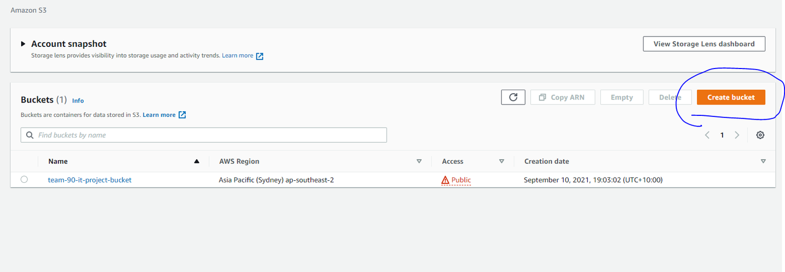

# WEEY CRM (Frontend)

A customer relationship management system, (Project_name) supports an environment-friendly mobile carpool app - ”WEEY”. To help the primary objective of the business, the reduction of greenhouse emission and delivery of their green tips, (Project_name) allows the personalization of the promotion to distinct customizable groups of users with different interests.

## Table of Contents

(Copy from the table of contents generator)

## Requirements

- User sorting, the admin will sort the customers/users of the app by age, gender, how environmentalist, time since joined, etc. This will help the admin to see which users are safe and how environmental-friendly are they.
- User grouping, it will allow the administrator to send green tips to users who are environmentalists to foster customer loyalty, this will also allow admins to send coupons to prompt them.
- Marketing analysis, we will be able to see the effectiveness of the coupons and emails by seeing how many emails were sent, opened and how many coupons are clicked, and used.

# Getting Started

These instructions will get you a copy of the project up and running on your local machine for development and testing purposes. See deployment for notes on how to deploy the project on a live system.

## Prerequisites

Make sure you have installed all of the following prerequisites on your development machine:

- Git - [Download & Install Git](https://git-scm.com/downloads). OSX and Linux machines typically have this already installed.
- Node.js - [Download & Install Node.js](https://nodejs.org/en/download/) and the npm package manager.
- MySQL- [Download & Install MySQL](https://www.mysql.com/downloads/), and make sure it's running on the default port.
- Yarn Package Installer - `npm install --global yarn`

## Configuration

## How to install/run the application

Once you have downloaded the prerequisites, you are just a few steps away from starting your application.

### Quick Install

The Weey CRM comes pre-bundled with a `package.json` file that contain the list of libraries you need to start your application.

To install these dependencies, open up the terminal and do the following:

```bash
$ yarn

//if not working it means you have not downloaded yarn

$ npm install --global yarn
$ yarn

//if not working, you can also use npm

$ npm install

```

This command does a few things:

- First it will install the dependencies needed for the application to run.
- If you're running in a development environment, it will then also install development dependencies needed for testing and running your application.
- When the npm packages install process is over, npm will initiate a bower install command to install all the front-end modules needed for the application
- To update these packages later on, just run `npm update`

### Running your application locally

You can run your application locally by doing the following command
(make sure you are in a root directory of your application cd /frontend-service)

```bash
$ yarn start
```

our application should run on port 3000 with the development environment configuration, so in your browser just go to http://localhost:3000

## Tests

You can run the full tests done in JEST by the following command

```bash
$ npm test
```

This will run the existing test cases done for the frontend application to ensure all of our components are working fine.

## Deployment Method

### Deploy using AWS Amplify

#### Access to GitHub Repository from AWS


In order to host your web app to AWS Amplify, you need to connect your repoisitory containing your source code.
To do this, you can navigate to AWS Console and go to AWS Amplify.

#### Connecting to your frontend repository


And once you select deploy your frontend application, the following will be given. Press Github in the selection

Ensure you have forked our repository or to be in our repository.


If you don't see the following repository, make sure your AWS is connected to your GitHub account properly.

#### Customize cli from AWS (Make Amplify run the command from cloud machine)


After that, click Next and AWS will ask you to configure your build and test settings. The base template that AWS provides is shown below.

Make sure to use "Yarn" package manger than NPM sinec this application is running around yarn.

#### Launch


Finally, after reviewing the settings for your application, click Save and Deploy and AWS will begin configuring and deploying your application. When AWS is done deploying, you can navigate to the Amplify home page and see your newly-deployed application.

Now you will get an ip address that you can connect to and if you access the ip address, your web app will be shown.

#### Get a Domain from Route53


If you don't like to have an ip address as your web page domain, you can add a custom domain to have your own customized web page link.

Access to AWS console and go to AWS Route53. And then you can get a contract of the domain name you want between 10-15 AUD.

Once you bought the domain it will take between 2-3 days for AWS people to hand you the DNS

#### Configure DNS


Once you have bought the domain now you will be able to configure CNAME to link it with your ip address.

#### Route settings


See how the domain has multiple records that are being connected to.
You will need to set up your webpage ip address with route53 by pressing create record.

#### Configure Domain from Amplify


If you do not like this method, you can go to AWS amplify and go to domain management tab and allow it to automatically do it for you.

Once everything is complete now your web page is successfully deployed!

### Deploy using AWS S3 Bucket +


#### Description

We will make a static web page deployment using a cloud S3 bucket through Amazon CloudFront to increase security and reducing cost.

By doing this, it will allow these customized commands to automatically deploy to the real hosting site.

#### Pre-Implementation

Test component to ensure it is ready to be deployed

Access to the React Component

Try the command to ensure the react component is able to start

```shell
yarn start (for yarn)
or
npm start (for npm)
```

Also you need to connect AWS CLI with your local machine (or pipeline)
Follow the steps below if you haven't configured CLI
https://docs.aws.amazon.com/cli/latest/userguide/cli-configure-quickstart.html

```
aws configure
AWS Access Key ID [None]: asdf
AWS Secret Access Key [None]: asdf
Default region name [None]: ap-southeast-2
Default output format [None]: json
```

#### AWS S3 Bucket


In the AWS console, search S3, then click on Create Bucket.


Then write a unique bucket name(it will complain if the name is already taken), and uncheck as per the image below.

- “Block all public access”

- “Block public access to buckets and objects granted through new public bucket or access point policies”

- “Block public and cross-account access to buckets and objects through any public bucket or access point policies”

Accept the warning for public access. and go to the bottom and create the bucket.

Click on the bucket, navigate to the permissions tab, edit bucket policy and paste the following. Ensure you fill in your bucket resource as per previous creation. Also note the //\* ending. This policy will allow us to access S3 publicly.

```
{
    "Version": "2012-10-17",
    "Statement": [
        {
            "Effect": "Allow",
            "Principal": "*",
            "Action": "s3:GetObject",
            "Resource": "arn:aws:s3:::<Fill in your S3 bucket here>/*"
        }
    ]
}
```


Under the Properties tab, at the bottom of the page find “Static Website Hosting”. Click edit, edit the following, and save changes:

- Static website hosting = enable

- Hosting type = Host a static website

- index document = index.html

The reason why we use index.html is that when we build our react app, the page generated we see is the index.html file.

Now we go back to our react app and navigate to ‘src/package.json’ and paste the following under ‘scripts’.

```
"deploy": "aws s3 sync build/ s3://<Fill in your S3 bucket here>"
```

What this will do is it will deploy our build to s3 automatically when we run “yarn deploy”.

Now in our CLI(PowerShell/cmd/terminal). Run “yarn build” to build the app.

```
yarn build
yarn deploy
```


Going back to the “static website hosting " section as per above, You should see a bucket URL endpoint there. Click on that and you should see your website now!

#### Setup Cloudfront to get it secured

You may have noticed that the S3 link is unsecure using http:// . We will remedy this using CloudFront!

- Navigate to CloudFront service, and create distribution.
- Under “Origin Domain” find and choose your S3 bucket. You should see a lot of things populated.
- Under “Default cache behaviour”, find “viewer protocol policy” and tick “Redirect HTTP to HTTPS”


Now create the Cloudfront and once deployed, copy the domain name of your CloudFront distribution and navigate there.

Again, click on the Cloudfront distribution and navigate to the ‘Origins’ tab. Find the origin we had and click edit.


Go back to S3 and copy the S3 static website URL we were hitting and paste that in “origin domain” and save changes.

Now it is successfuly deployed, try to access cloudfront URL to see whether the site ran in localhost:3000 and the static page is the same

## Built With

- React.JS
- MySQL

## Used Libraries

- axios
- chart.js
- react libraries
- styled-components
- jest
- mui

## Authors

- John Minseok Kim -
- Sooyoung Jung -
- Yifeng -
- Jun hee -

## License

This project is licensed under the Team 90, On-a-boat of the IT Project in University of Melbourne (2021)

## Version Control

Version 1 - User Table
Version 2 - Statistics, Grouping, Emailing, bug fixes
